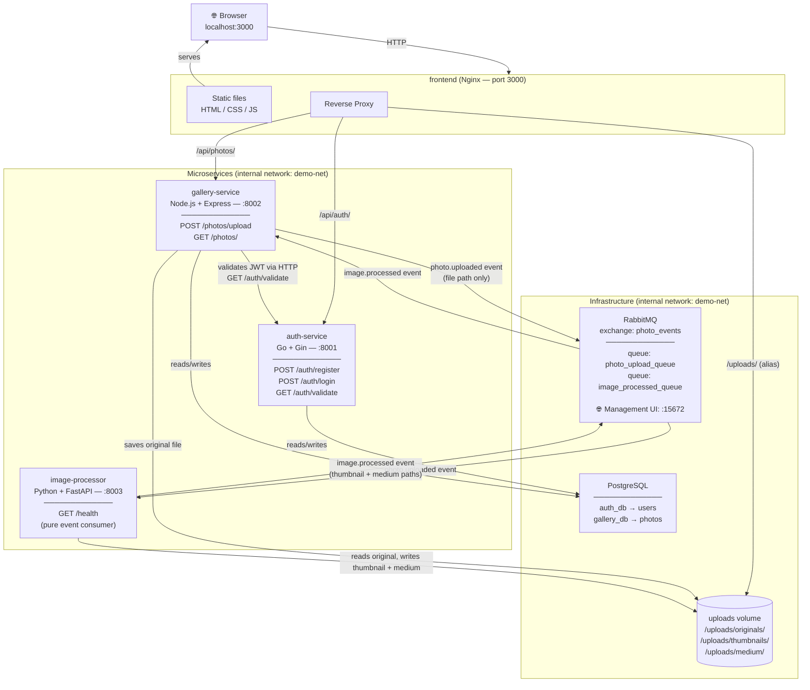
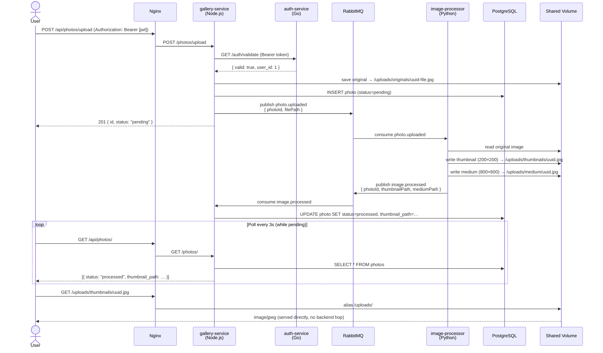

# PhotoDemo — Microservices Classroom Demo

An illustrative microservices application built for classroom use. It demonstrates three different languages/frameworks, event-driven communication via RabbitMQ, PostgreSQL persistence, and a simple frontend — all wired together with Docker Compose.

---

## Architecture Overview



---

## Event Flow — Photo Upload



---

## Services

| Service | Language | Framework | Port | Purpose |
|---|---|---|---|---|
| **auth-service** | Go | Gin | 8001 (internal) | User registration, login, JWT sign & validate |
| **gallery-service** | JavaScript | Express | 8002 (internal) | Photo upload, metadata, RabbitMQ publisher & consumer |
| **image-processor** | Python | FastAPI | 8003 (internal) | Async image resize/compress — pure event consumer |
| **frontend** | HTML/CSS/JS | Nginx | **3000 (public)** | Static UI + reverse proxy to all services |
| **rabbitmq** | — | — | **15672 (public)** | Message broker — Management UI for classroom demos |
| **postgres** | — | — | 5432 (internal) | Persistent storage for users and photo metadata |

### API Routes

| Method | Path (via Nginx) | Proxied to | Auth required |
|---|---|---|---|
| `POST` | `/api/auth/register` | auth-service | No |
| `POST` | `/api/auth/login` | auth-service | No |
| `GET` | `/api/auth/validate` | auth-service | Bearer token |
| `POST` | `/api/photos/upload` | gallery-service | Bearer token |
| `GET` | `/api/photos/` | gallery-service | Bearer token |
| `GET` | `/uploads/*` | Nginx alias → shared volume | No |

> **Note:** Nginx is the only public entry point. All service-to-service traffic stays on the internal `demo-net` Docker bridge network.

### RabbitMQ Exchange Design

Exchange: `photo_events` (direct, durable)

| Queue | Routing Key | Producer | Consumer |
|---|---|---|---|
| `photo_upload_queue` | `photo.uploaded` | gallery-service | image-processor |
| `image_processed_queue` | `image.processed` | image-processor | gallery-service |

Messages carry **file paths only** — binary image data travels through the shared volume, not the queue.

### Shared Volume — File Layout

```
/uploads/
├── originals/    ← written by gallery-service (multer)
├── thumbnails/   ← written by image-processor (200×200, JPEG q75)
└── medium/       ← written by image-processor (800×600, JPEG q85)
```

All three containers (`gallery-service`, `image-processor`, `frontend`) mount the same Docker named volume at `/uploads`. Nginx serves `/uploads/*` via a filesystem alias — processed images reach the browser without touching any backend service.

---

## Quick Start

```bash
cd MicroServicesDemo

# Build images and start all services
docker-compose up --build

# Open the app
open http://localhost:3000

# Watch RabbitMQ message flow live (guest / guest)
open http://localhost:15672
```

> The first build takes 3–5 minutes (downloading base images and dependencies). Subsequent starts are fast.

---

## Testing with curl

```bash
# 1. Register
curl -X POST http://localhost:3000/api/auth/register \
  -H 'Content-Type: application/json' \
  -d '{"username":"alice","email":"alice@example.com","password":"secret123"}'

# 2. Login — capture the JWT
TOKEN=$(curl -s -X POST http://localhost:3000/api/auth/login \
  -H 'Content-Type: application/json' \
  -d '{"email":"alice@example.com","password":"secret123"}' \
  | python3 -c "import sys,json; print(json.load(sys.stdin)['token'])")

# 3. Upload a photo
curl -X POST http://localhost:3000/api/photos/upload \
  -H "Authorization: Bearer $TOKEN" \
  -F "photo=@test.jpg"

# 4. List photos — watch status change from 'pending' to 'processed'
curl -H "Authorization: Bearer $TOKEN" http://localhost:3000/api/photos/ \
  | python3 -m json.tool
```

---

## Key Teaching Points

### 1. Reverse Proxy as the Single Entry Point
Nginx routes all traffic — no service is exposed directly to the browser. `/api/auth/*` goes to Go, `/api/photos/*` goes to Node.js, `/uploads/*` is served straight from the filesystem. Students see one URL; the routing is invisible.

> **Gotcha:** Nginx location blocks require trailing slashes to match correctly. `GET /api/photos` triggers a `301` redirect to `/api/photos/` — and because nginx reports its internal port (80) in the `Location` header rather than the Docker-mapped port (3000), the browser ends up hitting an unreachable address. Always include the trailing slash in `fetch()` calls.

### 2. Service-to-Service HTTP
`gallery-service` validates JWTs by calling `GET /auth/validate` on `auth-service` over the internal network. No JWT secret is shared — auth-service is the single source of truth for token validity.

### 3. Event-Driven Architecture
Image processing is fully **asynchronous**. gallery-service publishes a message and returns `201` immediately — the client doesn't wait for processing. The image-processor picks up the event in the background. The gallery page polls every 3 seconds to detect when the thumbnail is ready, making eventual consistency visible to students in real time.

### 4. Message Carries Metadata, Not Data
The RabbitMQ event payload is a small JSON object with a file path string. The actual image bytes travel via the shared Docker volume. This is a core design principle: message queues are for coordination, not bulk data transfer.

### 5. Startup Ordering
RabbitMQ and PostgreSQL take 10–20 seconds to initialise. `depends_on: condition: service_healthy` delays container starts, and each service implements an application-level retry loop as a second layer of defence.

### 6. Secrets Management (discussion point)
`JWT_SECRET` is hardcoded in `docker-compose.yml`. In production, secrets belong in Docker secrets, Kubernetes secrets, or a dedicated vault. The deliberate exposure here is a conversation starter.

### 7. Not Every Service is a REST API
`image-processor` has no photo endpoints — just `GET /health`. It exists purely to consume events and do work. FastAPI is there to demonstrate the framework and expose the health check; the real entry point is the RabbitMQ consumer.

---

## Project Structure

```
MicroServicesDemo/
├── docker-compose.yml
├── .env.example
├── db-init/
│   ├── 01_auth_schema.sql      # creates auth_db  → users table
│   └── 02_gallery_schema.sql   # creates gallery_db → photos table
├── auth-service/               # Go + Gin
│   ├── Dockerfile              # multi-stage: golang:1.22-alpine → alpine:3.19
│   ├── main.go
│   ├── config/config.go        # env-var loading
│   ├── db/db.go                # pg connection with retry
│   ├── models/user.go          # CreateUser, FindByEmail
│   ├── handlers/               # register.go, login.go, validate.go
│   ├── middleware/jwt.go        # GenerateToken, ParseToken
│   └── router/router.go        # route wiring + CORS
├── gallery-service/            # Node.js + Express
│   ├── Dockerfile              # node:20-alpine
│   ├── package.json
│   └── src/
│       ├── index.js            # app entry, starts RabbitMQ then HTTP
│       ├── config.js           # env-var loading
│       ├── db.js               # pg.Pool + query helper
│       ├── storage.js          # multer disk storage config
│       ├── rabbitmq.js         # publisher + consumer with retry loop
│       ├── middleware/auth.js  # delegates JWT validation to auth-service
│       └── routes/photos.js    # POST /upload, GET /
├── image-processor/            # Python + FastAPI
│   ├── Dockerfile              # python:3.12-slim
│   ├── requirements.txt
│   ├── main.py                 # FastAPI lifespan + GET /health
│   ├── rabbitmq_client.py      # aio-pika consumer/publisher
│   └── processor.py            # Pillow resize: thumbnail + medium
└── frontend/                   # Nginx
    ├── Dockerfile              # nginx:1.25-alpine
    ├── nginx.conf              # proxy rules + /uploads/ alias
    └── public/
        ├── index.html          # landing page
        ├── login.html
        ├── register.html
        ├── upload.html
        ├── gallery.html
        ├── style.css
        └── js/
            ├── auth.js         # login + register form handlers
            ├── upload.js       # drag-and-drop upload + FormData
            └── gallery.js      # photo grid + 3s polling for pending photos
```
